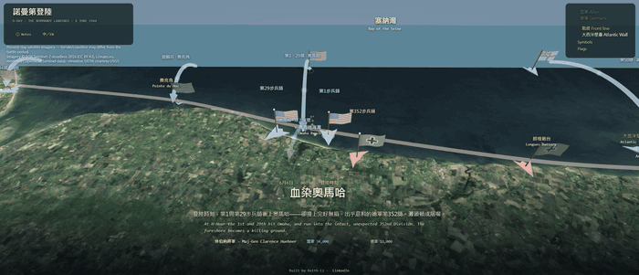
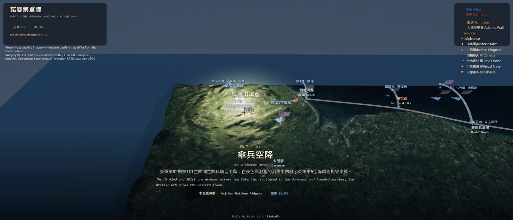
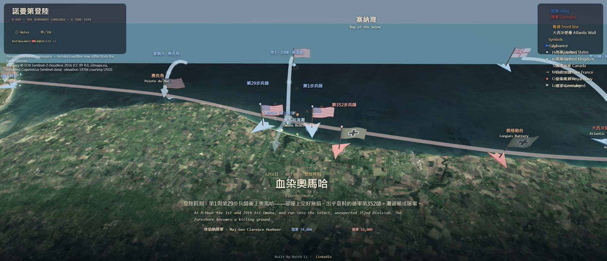
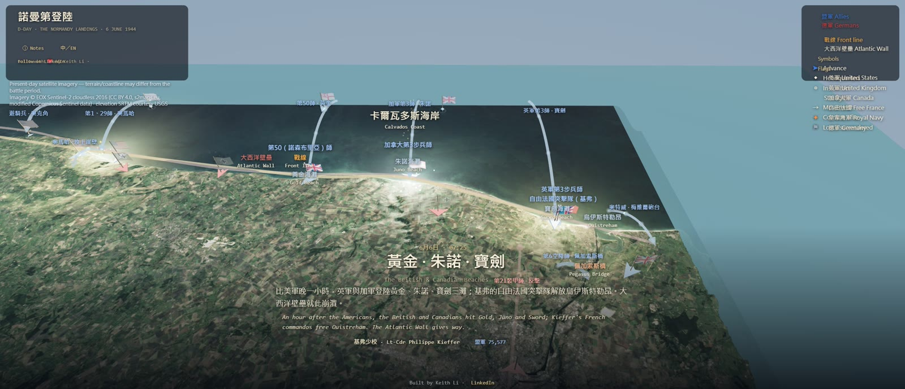
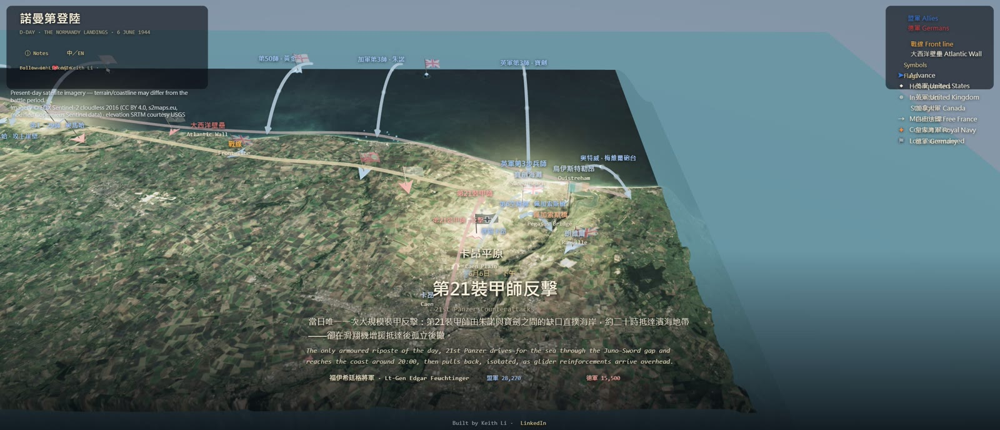

<div align="center">

# 諾曼第登陸 · D-Day: The Normandy Landings, 1944

### A self-playing 3D documentary of the 6 June 1944 landings, rendered on the **real terrain of Normandy**, with a directed cinematic camera and bilingual narration.

[](https://keithligh.github.io/d-day-normandy-1944/)
&nbsp;
[](https://github.com/keithligh/cinematic-3d-battle-engine)
&nbsp;
[](https://github.com/keithligh/d-day-normandy-1944)

[](LICENSE)
[](https://creativecommons.org/licenses/by/4.0/)
[](https://threejs.org/)
[](#run-it-locally)
[](https://claude.com/claude-code)

</div>

---

**D-Day**, 6 June 1944, was Operation Overlord: the Allied assault on German-occupied France, and the largest seaborne
invasion in history. This replays it in 3D on the **actual terrain of Normandy**: real elevation, real satellite
imagery, projected to scale. A camera **directs itself** across the landings, over historically-sourced troop
movements, the **real June 1944 flags**, bilingual narration, weather, and a day/night cycle. **Every frame is the live
engine. Nothing is mocked up.** No build step, no backend, no API keys: one folder of static files that runs in any
browser.

Just after midnight, three airborne divisions seized the flanks: the US 82nd and 101st over the Cotentin peninsula
around Sainte-Mère-Église, and the British 6th east of the Orne at Pegasus Bridge and the Merville Battery. At the
landing hour the seaborne assault hit five beaches: Utah and Omaha (American), Gold and Sword (British), and Juno
(Canadian), with Free French commandos at Ouistreham. Omaha, facing the veteran German 352nd Division, came close to
disaster; the other beaches broke through the Atlantic Wall. By nightfall the Allies held five beachheads, not yet
linked and with Caen still in German hands, but they had a foothold in Europe, at a cost of at least 4,400 Allied dead.

This documentary is built on **[cinematic-3d-battle-engine](https://github.com/keithligh/cinematic-3d-battle-engine)**,
an open-source engine that renders any battle as a self-playing 3D documentary on real-scale terrain. Fork it to your own.

## Gallery

[](https://keithligh.github.io/d-day-normandy-1944/)

<div align="center"><b>▶ <a href="https://keithligh.github.io/d-day-normandy-1944/">Try the live demo</a></b></div>

<table>
  <tr>
    <td width="50%"><br><sub><b>00:00 · The Airborne Drops.</b> The US 82nd and 101st drop over the Cotentin to seize the western flank.</sub></td>
    <td width="50%"><br><sub><b>06:30 · Bloody Omaha.</b> The 1st and 29th run into the intact, unexpected 352nd Division.</sub></td>
  </tr>
  <tr>
    <td><br><sub><b>07:25 · Gold, Juno, Sword.</b> The British and Canadians break the Atlantic Wall; the French free Ouistreham.</sub></td>
    <td><br><sub><b>Afternoon · 21st Panzer.</b> The only armoured counterattack of the day drives for the sea.</sub></td>
  </tr>
</table>

> Every frame is the live engine over real SRTM elevation and Sentinel-2 satellite imagery. Geography is present-day; see *Historical accuracy* below.

## Highlights

- 🗺️ **Real Normandy, to scale.** Actual SRTM elevation and Sentinel-2 satellite imagery, projected by real lng/lat. Not a stylised map.
- 🎬 **It directs itself.** A cinematic "Director" plays 6 to 9 June as a sequence of shots; grab the camera any time to free-look, and it resumes.
- ⚔️ **Historically sourced.** Dated troop movements, the five beaches, the airborne drops, the commanders, and the real June 1944 flags (the 48-star US flag, the green-leaf Canadian Red Ensign, the Free French tricolour with the Cross of Lorraine, and the German Iron Cross, never the swastika).
- 🌧️ **Atmosphere.** Naval gunfire, smoke, the Channel weather, and a day/night cycle.
- 🌏 **Bilingual.** 中文 and English narration and labels throughout.
- ⚡ **Zero infrastructure.** No build, no backend, no API keys; runs offline from static files.

## Run it locally

Map tiles must be loaded over HTTP (same-origin). Opening `index.html` via `file://` will **not** work.

1. **Fetch the terrain and imagery tiles (first time only):**
   ```
   node tools/fetch_tiles.mjs
   ```
   This downloads the elevation and satellite imagery tiles for the Normandy bounding box from their source providers
   into `lib/tiles/`. No account or API key is required.

2. **Serve and open:**
   ```
   node tools/serve.js
   ```
   then open <http://localhost:5050>. (Windows: double-click **`start.bat`**; macOS/Linux: `sh start.sh`.)

## How it works

- **Terrain:** AWS "Terrarium" elevation tiles (SRTM/USGS, public domain) decoded to a real height-mesh, Web-Mercator,
  to scale (with a vertical exaggeration for legibility).
- **Surface:** EOX *Sentinel-2 cloudless 2016* satellite imagery draped over the terrain.
- **Direction:** a state-machine "Director" plays a fixed storyboard of shots; free-look pauses it.
- Everything is data-driven from `data.js` (forces, dated movement tracks, front lines, weather, storyboard,
  narration). The `.js` modules are the engine; `index.html` is the page.

## How it was built

You can build something like this yourself: fork **[cinematic-3d-battle-engine](https://github.com/keithligh/cinematic-3d-battle-engine)**,
the open engine this documentary runs on. This one came first, before that engine existed, so it was built the harder
way, through agentic engineering. It started from a single initial prompt and was engineered by hand from there: the
architecture, the research, and the shot-by-shot direction that turn a prompt into a finished film. Agentic
engineering, not prompt-to-app.

## Licensing

- **Code** (the `.js` source, `index.html`, `tools/`): **MIT**, see [`LICENSE`](LICENSE).
- **Narration, scenario data and text content:** **CC BY 4.0**, <https://creativecommons.org/licenses/by/4.0/>.
- **Bundled and fetched third-party software and data** (Three.js, Sentinel-2 imagery, SRTM/USGS elevation) retain
  their own licenses; see [`THIRD_PARTY_NOTICES.md`](THIRD_PARTY_NOTICES.md).

## Credits and data sources

- Satellite imagery: **Sentinel-2 cloudless 2016 © EOX IT Services GmbH** (s2maps.eu); contains modified Copernicus Sentinel data.
- Elevation: **SRTM, courtesy U.S. Geological Survey** via AWS Terrain Tiles.
- 3D engine: **Three.js** (MIT), via **[cinematic-3d-battle-engine](https://github.com/keithligh/cinematic-3d-battle-engine)**.
- Historical sources: Wikipedia "Normandy landings"; Gordon A. Harrison, *Cross-Channel Attack* (U.S. Army Center of
  Military History); Cornelius Ryan, *The Longest Day*; the Imperial War Museums; the National WWII Museum; the Juno
  Beach Centre; and the U.S. National D-Day Memorial (casualty figures).

## Historical accuracy (please read)

This is an **illustrative reconstruction**, not an authoritative tactical record:

- **Geography is present-day.** The satellite imagery and elevation are modern. The 1944 coastline, the Cotentin
  marshes the Germans deliberately flooded (since drained), the Atlantic Wall fortifications, and postwar construction
  (the Ouistreham ferry port, the Mulberry harbour remains at Arromanches, modern roads) all differ from June 1944.
  Beaches and unit positions are shown only approximately, anchored to real place-name coordinates.
- **Strengths are D-Day approximations.** About 156,000 Allied troops landed on 6 June (roughly 73,000 American and
  83,000 British and Canadian, including some 23,400 airborne). German divisions are shown at representative strength,
  not their full committed force.
- **Troop positions are narrative-schematic.** They are anchored to real coordinates, not an hour-by-hour tactical map.
- **Unit markers fly the real flag each force used in June 1944:** the 48-star United States flag (1912 to 1959), the
  1801 Union Flag, the Canadian Red Ensign (green maple leaf, 1922 to 1957), the Free French tricolour with the Cross
  of Lorraine, and, for the German forces, the **Iron Cross (Balkenkreuz), the Wehrmacht's insignia**. The Iron Cross
  is used deliberately and **not the swastika**: it is historically accurate, legal everywhere including Germany, and
  avoids a prohibited symbol.

## Author

Built by **Keith Li**. Find me on [LinkedIn](https://www.linkedin.com/in/keithlihk/).
